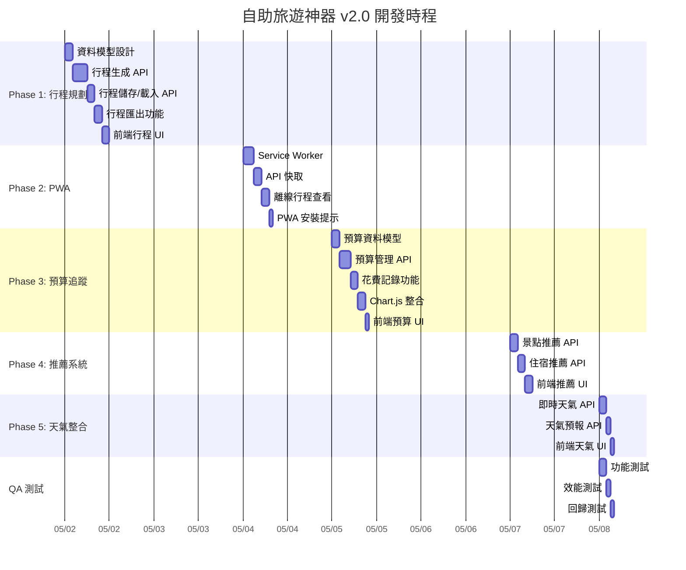
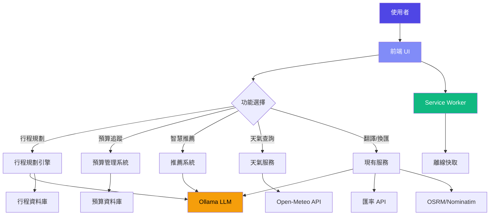

# 🌍 自助旅遊神器 - 專案執行計畫書

> 版本: 1.0.0 | 日期: 2026-05-02 | 狀態: 規劃中

---

## 1. 專案資訊

| 項目 | 內容 |
|------|------|
| 專案名稱 | 自助旅遊神器 v2.0 |
| 專案經理 | PM (AI) |
| 研發工程師 | RD (AI) |
| 品質保證 | QA (AI) |
| 開始日期 | 2026-05-02 |
| 預計完成 | 2026-05-09 |
| 總工時 | 40 小時 |

---

## 2. 工作分解結構 (WBS)

### 2.1 Phase 1: 行程規劃引擎 (12 小時)
- [ ] 2.1.1 設計行程資料模型 (2h)
- [ ] 2.1.2 實作行程生成 API (4h)
- [ ] 2.1.3 實作行程儲存/載入 API (2h)
- [ ] 2.1.4 實作行程匯出功能 (2h)
- [ ] 2.1.5 前端行程 UI 開發 (2h)

### 2.2 Phase 2: 離線 PWA 模式 (8 小時)
- [ ] 2.2.1 建立 Service Worker (3h)
- [ ] 2.2.2 實作 API 回應快取 (2h)
- [ ] 2.2.3 實作離線行程查看 (2h)
- [ ] 2.2.4 PWA 安裝提示 (1h)

### 2.3 Phase 3: 預算追蹤器 (10 小時)
- [ ] 2.3.1 設計預算資料模型 (2h)
- [ ] 2.3.2 實作預算管理 API (3h)
- [ ] 2.3.3 實作花費記錄功能 (2h)
- [ ] 2.3.4 整合 Chart.js 圖表 (2h)
- [ ] 2.3.5 前端預算 UI 開發 (1h)

### 2.4 Phase 4: 智慧推薦系統 (6 小時)
- [ ] 2.4.1 景點推薦 API (2h)
- [ ] 2.4.2 住宿推薦 API (2h)
- [ ] 2.4.3 前端推薦 UI (2h)

### 2.5 Phase 5: 天氣整合 (4 小時)
- [ ] 2.5.1 即時天氣 API (2h)
- [ ] 2.5.2 天氣預報 API (1h)
- [ ] 2.5.3 前端天氣 UI (1h)

---

## 3. 甘特圖 (Gantt Chart)



---

## 4. 系統架構流程圖



---

## 5. 魚骨圖分析 (潛在問題)

```mermaid
fishbone
    title 自助旅遊神器 - 潛在問題分析
    
    main
        行程生成慢
            模型載入時間
            API 回應時間
            網路延遲
        離線功能失效
            Service Worker 相容性
            快取策略錯誤
            儲存空間不足
        預算計算錯誤
            匯率轉換錯誤
            資料型別錯誤
            邊界條件未處理
        推薦不準確
            訓練資料不足
            提示詞設計不良
            使用者偏好未捕捉
        地圖載入慢
            瓦片載入時間
            GPS 定位延遲
            網路連線不穩
```

---

## 6. 優先級設定 (MoSCoW)

### Must Have (必須)
- [x] 行程規劃引擎
- [x] 離線 PWA 模式
- [x] 預算追蹤器
- [x] 基礎推薦系統

### Should Have (應該)
- [x] 天氣整合
- [x] 行程匯出功能
- [x] Chart.js 圖表

### Could Have (可以)
- [ ] 社群分享
- [ ] 多使用者協作
- [ ] 進階分析

### Won't Have (本次不做)
- [ ] 移動 App
- [ ] 後端資料庫
- [ ] 使用者認證

---

## 7. 檢查點設定

| 檢查點 | 日期 | 檢查項目 | 負責人 |
|--------|------|---------|--------|
| CP1 | 2026-05-03 | Phase 1 完成 | PM |
| CP2 | 2026-05-05 | Phase 2 完成 | PM |
| CP3 | 2026-05-06 | Phase 3 完成 | PM |
| CP4 | 2026-05-07 | Phase 4 完成 | PM |
| CP5 | 2026-05-08 | Phase 5 完成 | PM |
| CP6 | 2026-05-09 | QA 測試完成 | QA |

---

## 8. 資源分配

| 角色 | 工時 | 主要任務 |
|------|------|---------|
| PM | 8h | 規劃、協調、檢查 |
| RD | 28h | 開發、實作、修復 |
| QA | 4h | 測試、驗證、回報 |

---

## 9. 風險緩解計畫

| 風險 | 緩解措施 | 負責人 |
|------|---------|--------|
| Ollama 載入慢 | 預熱機制、回應快取 | RD |
| API 限流 | 快取、退避重試 | RD |
| PWA 相容性 | 漸進式增強、fallback | RD |
| 預算計算錯誤 | 單元測試、邊界測試 | QA |

---

**文件狀態**: 草稿  
**最後更新**: 2026-05-02  
**作者**: PM  
**審核**: 待審核
